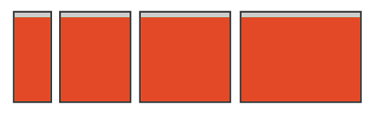
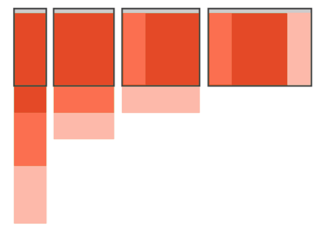
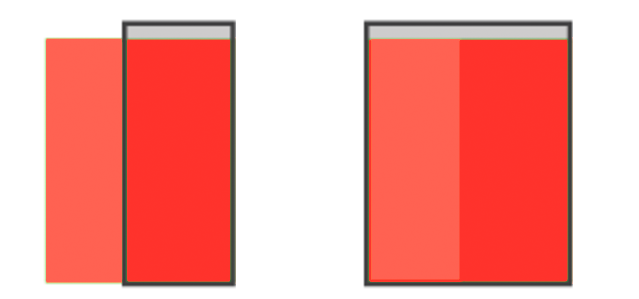

# Responsive Design Patterns
##Patrones de diseño responsivo con [Flexgrid](https://github.com/alexballera/flexgrid)
## Overview
* [Tiny Tweaks](#tiny-tweaks)
* [Mostly Fluid](#mostly-fluid)
* [Column Drop](#column-drop)
* [Layout Shifter](#layout-shifter)
* [Off Canvas](#off-canvas)
* [Referencias](#referencias)
* [Licencia](#licencia)

##Tiny Tweaks
  
**HTML**  
```html
<nav class="nav">Navbar</nav>
<div class="container">
  <div class="row">
    <article class="col">
    <h2>Tiny Tweaks</h2>
    <p> Lorem...</p>
   </article>
  </div>
</div>
```
**Styles**  
```css
@media screen and (min-width: 37.5em){
  .col{
    font-size: 1.2em;
  }
}
@media screen and (min-width: 48em){
  .col{
    font-size: 1.4em;
  }
}
@media screen and (min-width: 64em){
  .col{
    font-size: 1.6em;
  }
}
```
##Mostly Fluid
  
**HTML**  
```html
  <div class="container-fluid">
    <div class="row">
      <section class="c1 col-12 col-lg-12 col-xl-8">Sección 1</section>
      <section class="c2 col-12 col-lg-6 col-xl-4">Sección 2</section>
      <section class="c3 col-12 col-lg-6 col-xl-4">Sección 3</section>
      <section class="c4 col-12 col-lg-6 col-xl-4">Sección 4</section>
      <section class="c5 col-12 col-lg-6 col-xl-4">Sección 5</section>
    </div>
  </div>
```
**Styles**  
```css
.c1{
  background: #705F9E;
  height: 600px;
}
.c2{
  background: #5F989E;
  height: 200px;
}
.c3{
  background: #EE9786;
  height: 200px;
}
.c4{
  background: #F1BFC1;
  height: 200px;
}
.c5{
  background: #F3E8B3;
  height: 200px;
}
@media screen and (min-width: 64em){
    .c2{
    height: 600px;
  }
}
```
##Column Drop
  
**HTML**  
```html
  <div class="container-fluid">
    <div class="row">
      <section class="c1 col-12 col-md-12 col-lg-8 col-xl-6">Sección 1</section>
      <section class="c2 col-12 col-md-6 col-lg-4 col-xl-3 first-lg first-xl">Sección 2</section>
      <section class="c3 col-12 col-md-6 col-lg-12 col-xl-3">Sección 3</section>
    </div>
  </div>
```
**Styles**  
```css
.c1{
  background: #705F9E;
  height: 600px;
}
.c2{
  background: #5F989E;
  height: 200px;
}
.c3{
  background: #EE9786;
  height: 200px;
}

@media screen and (min-width: 48em){
    .c2{
    height: 600px;
  }
}
@media screen and (min-width: 64em){
    .c3{
    height: 600px;
  }
}
```
##Layout Shifter
  
**HTML**  
```html
    <div class="row">
      <section class="c1 col">Seccion 1</section>
      <div class="container-inner">
          <section class="c2 col">Seccion 2</section>
          <section class="c3 col">Seccion 3</section>
      </div>
    </div>
```
**Styles**
```css
.container-inner {
  width: 100%;
}
.c1 {
    background-color: #705F9E;
    height: 150px;
}
.c2 {
    background-color: #5F989E;
    height: 400px;
}
.c3 {
    background-color: #EE9786;
    height: 400px;
}
@media (min-width: 50em) {
  .row {
    width: 50em;
    margin: 0 auto;
  }
  .c1 {
    height: 800px;
    width: 25%;
  }
  .container-inner {
    width: 75%;
  }
}
```
##Off Canvas
  
**HTML**  
```html
  <body>
    <div class="container-fluid">
      <section class="c1" id="sidePanel">Seccion 1</section>
      <section class="c2" id="mainPanel">Seccion 2</section>
    </div>
    <script src="../vendors/hammer.min.js"></script>
    <script src="main.js"></script>
  </body>
```
**Styles**
```css
.container-fluid{
  font-size: 1.5em;
  font-weight: 700;
}
.c1 {
    background-color: #705F9E;
    position:absolute;
    height: 100vh;
    width: 250px;
    color: white;
    transform: translate(-250px, 0);
    transition: transform .3s ease-out;
    z-index: 1;
}
.c1.open {
  transform: translate(0,0);
}
.c2 {
    background-color: #5F989E;
    width: 100%;
    height: 100vh;
    position: absolute;
}
```
##Referencias
**Carlos Azaustre** [Los 5 patrones del Responsive Design con Flexbox](https://carlosazaustre.es/blog/los-5-patrones-del-responsive-design/)  
**Luke Wroblewski** [Multi-Device Layout Patterns](http://www.lukew.com/ff/entry.asp?1514)  
**Google Developers** [Responsive web design patterns](https://developers.google.com/web/fundamentals/design-and-ui/responsive/patterns/?hl=en)  
##Licencia
[The MIT License (MIT)](https://github.com/alexballera/responsive-design-patterns/blob/master/LICENSE) Copyright (c) 2015 Alex Ballera  
